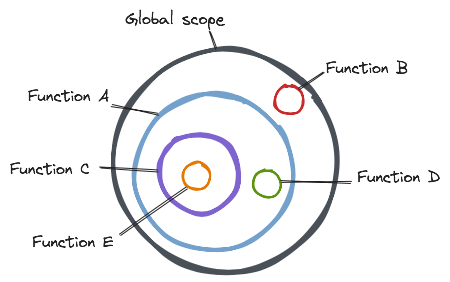

# Distinguishing actions, calculations and data

> Prefer data to calculations and calculations to actions.

## Data

***Data is facts about events*** — a record of something that happened.

Data should never change — producing new data instead of overwriting data allow us to make comparisons and proceed one way or another depending on whether or not the data has changed.

Like accounting, functional programming relies on *record-keeping*.

Data can only be composed of more data — data encodes meaning in structure, much of the work is to think about how to represent data so that it can be interpreted now and reinterpreted in the future.

In functional programming we separate processes that generate data from processed that consume data.

Advantages of data over calculations:

- *Serializable* — data is not runnable, no problem being transmitted over a wire or stored to disk and read back later.
- *Comparable* — easily compare two pieces of data to see if they are equal or not.
- *Interpretation* — data can be interpreted in multiple ways.

### Data access

***Variables*** bind names with addresses in memory — if you have access to the variable you have access to the data.

The ability to change the address to which the variable is pointing is called *rebinding*.

Variable behavior is determined by the variable declaration type:

<table>
    <tr>
        <td><code>const</code></td>
        <td>
            <ul style="margin: 4px;">
                <li>Name must be bound to an address at declaration time.</li>
                <li>Rebinding is not allowed.</li>
                <li>Block scope, not hoisted.</li>
            </ul>
        </td>
    </tr>
    <tr>
        <td><code>let</code></td>
        <td>
            <ul style="margin: 4px;">
                <li>Name does not need to be bound to an address at declaration time.</li>
                <li>Rebinding is allowed.</li>
                <li>Block scope, not hoisted.</li>
            </ul>
        </td>
    </tr>
</table>

Avoid `var` which has *function scope* and is *hoisted*. 

***Scopes*** determine accessibility to variables — a variable is bound to the scope where it was declared.

There is block scope, function scope and global scope.

Any given code has access variables declared in it's local scope scope and outer scopes — e.g. code in function `E` has access to all data bound to variables declared in functions `C`, `A` and `Global scope` but does not have access to data bound to variables declared in functions `D` or `B`.

<!-- ------------------------------------------------------------- -->

Having access to a variable that allows rebinding from multiple scopes has the same effect as if the data itself was mutable (even if it is not).

| Input type | Input behavior                                  |
| ---------- | ----------------------------------------------- |
| Explicit   | - Explicit inputs are passed via arguments.  |
             -  
             -  |
| Implicit | - Immutable (always). - Passed and compared by value.

Functions have outputs:

To avoid time dependency 

This means that primitive values have built in *copy-on-write* behavior, objects don't. When you pass objects to functions they become *shared mutable state* by default.

Functions that read from or write to *shared mutable state* are actions because <mark>*shared mutable state* is time dependent</mark> (the value can be different at different times). **Calculations require immutable inputs and immutable outputs**.

*Copy-on-write* and *defensive-copying* are effective but expensive. Use a library like [Immer](https://github.com/immerjs/immer) which implements immutability without affecting too much on performance due to structural sharing (deep-freezing source objects before relying on them, instead of copying them).

Producing immutable objects is slower, but comparing references is much much faster than doing deep value comparisons. Reading and comparing happen more ofter than writing.

### Data mutability

changing the pointer of a variable has nothing to do with data immutability.

<!-- ------------------------------------------------------------- -->

In JavaScript, data is implemented using built-in data types.

Mutability depends on the data type:

<table>
    <tr>
        <td>Primitives</td>
        <td>
            <ul style="margin: 4px;">
                <li>All primitive values are immutable.</li>
                <li>Applying an operation on immutable data does not overwrite it — new data is produced.</li>
            </ul>
        </td>
    </tr>
    <tr>
        <td>Objects</td>
        <td>
            <ul style="margin: 4px;">
                <li>All objects are mutable by default — freezing is a shallow operation.</li>
                <li>Applying an operation to mutable data will overwrite it.</li>
            </ul>
        </td>
    </tr>
</table>

<!-- ------------------------------------------------------------- -->

## Actions

In JavaScript, we use functions to implement actions.

***Any function that depends on time is an action*** — the result of an action could be different depending on *when* we call the function (any time range) or *how many times* we call the function.

<mark>***Time dependency is a big deal***</mark>, it makes code much harder to reuse, test and maintain. Because actions are the hardest to get right, we separate them so we can devote more focus to them.

<mark>***Shared mutable state is time dependent***</mark> 

***Keep actions small***, remove everything that isn’t necessary from the action. Restrict actions to interactions with the world.

Minimize implicit inputs and outputs — any that you can eliminate will improve the testability and reusability of your actions, even if you don’t cross into calculation land. Select and extract the calculation code, convert implicit inputs to arguments, and implicit outputs to return values. Reading 

Limit time dependency whenever possible — e.g. allow an action to run once.

Actions often depend on smaller actions, calculations, and data. Decompose an action into smaller actions repeatedly until no more actions are needed, then compose them back.

<!-- ------------------------------------------------------------- -->

## Calculations

In JavaScript, we use functions to implement calculations.

Any function that does *not* depend on time is a calculation.

Calculations depend on their arguments and their arguments only, always return value and never affect anything outside the calculation scope. It doesn't matter when they are run, or how many times they are run, **they** will always give the same output for the same inputs.

Calculations are *referentially transparent* — meaning that the function execution can be replaced with the returned value and nothing is affected.

Calculations can be composed of smaller calculations and data. Decompose a calculation into smaller calculations until the implementation becomes obvious, then compose them back.

Beware, <mark>***dependence on time spread all over***</mark>, all code depending on an action becomes an action itself — no matter how nested the action is in the call-stack.

Compared to actions, calculations offer the following **advantages**:

- No need to worry about what else is running at the same time, what has run in the past and what will run in the future or how many times you have already run it already.
- More composable.
- Much easier to test.
- Ready for distributed systems.
- Easier to be analyzed by a machine — static analysis.
