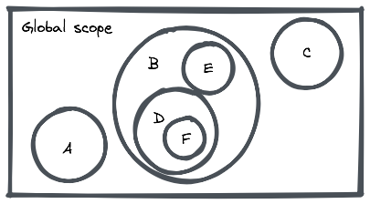

# Distinguishing actions, calculations and data

> Prefer data to calculations and calculations to actions.

## Data

Data means values — in JavaScript, data is implemented using built-in data types.

The set of types consists of:

- *Primitive values* — immutable values represented directly at the lowest level of the language.
  - Boolean type
  - Null type
  - Undefined type
  - Number type
  - BigInt type
  - String type
  - Symbol type

- *Objects* — collections of properties (key-value pairs).

#### Mutability

Values are stored in memory — to access a value you need it's address in memory, if you have access to the address you have access to the value.

Mutability is the ability of a value to change without changing it's address in memory.

Primitive values are immutable — operations never mutate primitive values, new values with new addresses are created every time.

Objects are mutable — operations mutate objects, the value on the address changes.

#### Variables and Scope

Variables are records that bind name identifiers to addresses in memory.

Only variables defined with `let` are allowed to change it's address value after declaration — don't confuse rebinding with mutability, one is a property of the variable and the other one is a property of the data.

Scopes determine access to variables — a variable belongs to the scope where it was defined.

There are 3 types of scopes:
- *Global scope* — parent of all scopes.
- *Function scope* — delimited by the function body.
- *Block scope* — delimited by brackets.

Scopes nest — inner scopes have access to outer scopes but outer scopes do not have access to inner scopes.

e.g. code inside scope `F` has access to all data bound to variables declared in scopes `D`, `B` and `Global Scope` but does not have access to data bound to variables declared in scopes `A`, `E` and `C`.

Variables defined with `const` and `let` have block scope. Avoid `var` which has function scope.

#### Shared variables

Data bound to a variable that is accessible by many scopes is shared by all of them.

> Relying on shared mutable data has a lot of implications that makes code much more complex and bug prone — notice that having access to a shared variable that allows rebinding has the same effect as mutable data, even when it is not.

#### Equality

Primitive values are compared by value — comparing two variables with different addresses but same values in memory will return `true`. It's easier to think that immutables values exist only once and that all variables that need the same value point to the same address.

Objects are compared by address — comparing two variables with different addresses but values in memory are objects with the exact same properties and values will return `false`.

#### Structure

Data can only be composed of more data.

Structure is what gives meaning to data — choosing the right data structure is critical for a straight forward implementation.

#### Data and Functional Programming

Functional programming looks at data as ***facts about events*** — a record of something that happened.

Never mutate data — like accounting, functional programming relies on *record-keeping*.

Separate the processes that generate data from the ones that consume it.

Advantages of data over calculations:

- *Serializable* — no problem being transmitted over a wire or stored to disk and read back later.
- *Comparable* — easily compare two pieces of data to see if they are equal or not.
- *Open for interpretation* — data can be interpreted in multiple ways.

## Calculations

Calculations are functions from inputs to outputs. No matter when they are run, or how many times they are run, they will always give the same output for the same inputs.

#### Inputs

All inputs must be explicit.

A function is called with an argument list containing zero or more expressions, separated by commas. Each of those expressions is evaluated and bound to a parameter of the function.

<!-- ------------------------------------------------------------- -->

No implicit inputs — never read from shared variables. Data hold in closures is fine because it is not shared between scopes.

No explicit outputs — never write to shared variables and never interact with the world.

Calculations are *referentially transparent* because a call to a calculation can be replaced by its result.

Calculations are *time independent* because 

No matter when they are run, or how many times they are run, they will always give the same output for the same inputs.

The result of running a calculation never depends on outer scope. The only effect of running a calculations is its returned value.

Any function that does *not* depend on time is a calculation.

Calculations depend on their arguments and their arguments only, always return value and never affect anything outside the calculation scope. It doesn't matter when they are run, or how many times they are run, **they** will always give the same output for the same inputs.

Calculations are *referentially transparent* — meaning that the function execution can be replaced with the returned value and nothing is affected.

Calculations can be composed of smaller calculations and data. Decompose a calculation into smaller calculations until the implementation becomes obvious, then compose them back.

Beware, <mark>***dependence on time spread all over***</mark>, all code depending on an action becomes an action itself — no matter how nested the action is in the call-stack.

Compared to actions, calculations offer the following **advantages**:

- No need to worry about what else is running at the same time, what has run in the past and what will run in the future or how many times you have already run it already.
- More composable.
- Much easier to test.
- Ready for distributed systems.
- Easier to be analyzed by a machine — static analysis.

<!-- ------------------------------------------------------------- -->

This means that primitive values have built in *copy-on-write* behavior, objects don't. When you pass objects to functions they become *shared mutable state* by default.

Functions that read from or write to *shared mutable state* are actions because <mark>*shared mutable state* is time dependent</mark> (the value can be different at different times). **Calculations require immutable inputs and immutable outputs**.

*Copy-on-write* and *defensive-copying* are effective but expensive. Use a library like [Immer](https://github.com/immerjs/immer) which implements immutability without affecting too much on performance due to structural sharing (deep-freezing source objects before relying on them, instead of copying them).

Producing immutable objects is slower, but comparing references is much much faster than doing deep value comparisons. Reading and comparing happen more ofter than writing.

<!-- ------------------------------------------------------------- -->

## Actions

In JavaScript, we use functions to implement actions.

***Any function that depends on time is an action*** — the result of an action could be different depending on *when* we call the function (any time range) or *how many times* we call the function.

<mark>***Time dependency is a big deal***</mark>, it makes code much harder to reuse, test and maintain. Because actions are the hardest to get right, we separate them so we can devote more focus to them.

<mark>***Shared mutable state is time dependent***</mark> 

***Keep actions small***, remove everything that isn’t necessary from the action. Restrict actions to interactions with the world.

Minimize implicit inputs and outputs — any that you can eliminate will improve the testability and reusability of your actions, even if you don’t cross into calculation land. Select and extract the calculation code, convert implicit inputs to arguments, and implicit outputs to return values. Reading 

Limit time dependency whenever possible — e.g. allow an action to run once.

Actions often depend on smaller actions, calculations, and data. Decompose an action into smaller actions repeatedly until no more actions are needed, then compose them back.

<!-- ------------------------------------------------------------- -->

