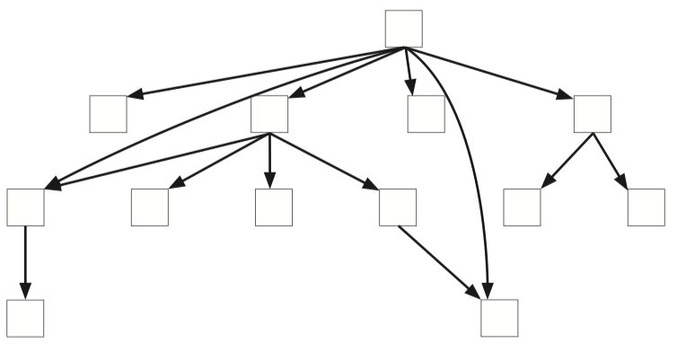

# Stratified design

### Design is about pulling things apart

You can solve any problem by decomposing it into smaller problems. At some point the solutions to the smaller problems will become obvious, then all you have to do is compose them back to solve the bigger problem.

In programming, functions give us a very natural way to separate concerns. Very often, we are tempted to put things together. Bigger, more complex things feel more substantial. But things that are pulled apart can always be composed back together.

> The hard part is figuring out useful ways to pull them apart

### What is stratified design?

Stratified design is a technique for organizing our functions into layers of abstraction, where each function is implemented in terms of functions defined in the layers below it. The layer structure shows us which code is more testable, changeable, and reusable.

There are four patterns that will help our design sense:

#### 🚀 &nbsp; Pattern 1: Straight forward implementation

The layer structure of stratified design should help us build straightforward implementations. The problem the function signature presents should be solved at the right level of detail in the body. Too much detail is a code smell.

- **Straightforward code solves a problem at a single level of detail** — if we code without regard to design, we often have code that is hard to read and modify. But why is it so hard? Most often, the code is hard to read because you have to understand it at *different levels of detail*. There is a lot to understand to read the function. Straightforward implementations try to narrow the levels of detail you need to understand in order to read the code.
- **Stratified design helps us target a specific level of detail** — while it’s not an easy formula, we can train our sense of design to look out for these levels of detail with a variety of clues in the code. We can then make appropriate changes.
- **The call graph gives us a rich source of clues about levels of detail** —  the code itself gives us a lot of clues, but there’s often too much to read at once to get a big picture view. A call graph can show us how many functions are defined in terms of each other. As we draw the graph, we can place functions at layers that correspond to their level of detail. Using the function signature, body, and call graph, we have a lot of information to help us write straightforward code.
- **Extracting out a function makes a more general function** — one way to make a function more straightforward is to extract out a more general function that takes care of details we don’t want to deal with at that level. *Low-level code is always a good candidate for extraction.* Extraction makes the new implementation more readable through clearer code and appropriate naming. As we pull things apart, and as functions have single responsibilities, we will find that they are easy to organize around concepts. Also, they are easier to test and maintain since they handle one specific detail. 
- **More general functions are more reusable** — as functions are extracted, it is common to find other places for them to be used. This is different from looking for “duplicate code.” We extract out general functions in order to clarify an implementation. But it turns out that general functions are more generally useful than specific functions. There will be serendipitous reuse.
- **We don’t hide the complexity** — it is very easy to make any code look straightforward. We could hide unclear code in “helper functions.” However, this is not stratified design. In stratified design, we want *every layer to be straightforward*. We can’t just move the complex stuff out of our current layer. We want to find general functions at a lower level that are themselves straightforward, out of which we can build our software in a straightforward way.

#### 🚀 &nbsp; Pattern 2: Abstraction barrier

Some layers in the graph provide an interface that lets us hide an important implementation detail. These layers help us write code at a higher level and free our limited mental capacity from unnecessary details.

Abstraction barrier is a very powerful pattern. It <mark>*strongly decouples*</mark> code above the barrier from code at and below the barrier. An abstraction barrier decouples by defining details that don’t have to be considered on either side of the barrier. Typically, the code above the barrier can ignore implementation details such as which data structure is used. The code at or below the barrier can ignore the higher-level details like what the functions are being used for. The functions in the barrier can be used for anything, and they don’t have to care.

All abstractions work like that: They define what code above and below doesn’t have to care about. Any particular function could define the same details to ignore. The abstraction barrier just makes this definition very strongly and explicitly. We call a layer an abstraction barrier when all of the functions work together in a layer let us ignore the same thing when working above that layer.

Abstraction barriers make change easy, but that’s not why we should use them. They should be used strategically to reduce inter-team communication and help clarify messy code.

The key thing to remember about abstraction barriers is that it’s all about ignoring details.

#### 🚀 &nbsp; Pattern 3: Minimal interface

We can think of the functions that define an abstraction barrier as an interface. They provide the operations through which we will access and manipulate a set of values. The minimal interface pattern guides us to protect our interface from unnecessary changes or expansion.

In stratified design, we find a dynamic tension between the completeness of the abstraction barrier and the pattern to keep it minimal.

There are many reasons to keep the abstraction barrier minimal:

1. Interfaces act as connectors, change the connector and you will need to change all the connected parts as well.
2. Code in the barrier is lower level, changes here are more likely to introduce bugs.
3. Low-level code is harder to understand.
4. More functions in an abstraction barrier mean more coordination between teams.
5. A larger interface to our abstraction barrier is harder to keep in your head.

> Applying this pattern in practice means that if you can implement a function above a layer, using existing functions in that layer, you should

Think carefully about the purpose of the function and at what layer of abstraction it makes sense to implement it. In general, you should prefer higher layers on the graph.

Although the benefit of the minimal interface pattern is clearest in the case of abstraction barriers, it applies generally to all layers. In the ideal case, a layer should have as many functions as necessary, but no more. And, also ideally, the functions should not have to change, nor should you need to add functions later. The set should be complete, minimal, and timeless. This is the ideal to which the minimal interface pattern draws all layers.

Is this possible? Yes, we do see it happening, though not for every layer. We see the ideal achieved when we find a file of source code that has not been modified for years, yet the functions in it are used heavily throughout the codebase. This ideal is achievable at the lower layers of your call graph if they define a small set of operations that provide great power. But keep in mind that it is an ideal to strive toward, not a destination.

The key thing is to sharpen your sense of how well the functions in the layer serve their purpose. Do they do it well, with a small number of functions? Does your change really add to that purpose?

#### 🚀 &nbsp; Pattern 4: Comfortable layers

The first three patterns have asked us to build our layers. The fourth and final pattern, comfortable layers, asks us to consider the practical side. We don’t want to add layers for sport. The code and its layers of abstraction should feel comfortable to work in.

Building great abstractions can often take too much time, the comfort pattern gives us a practical test of when to stop striving for the other patterns and also when to start again. If we are comfortable working in the code, we can relax on design. Let the for loops go unwrapped. Let the arrows grow long and the layers meld into one another.

There is constant tension between design and the need for new features. Let comfort guide you on when to stop.

### What does the graph show us about our code?

*Functional requirements* are the things the software has to do to work correctly. For instance, get the right answer when it does a tax calculation.

*Nonfunctional requirements* (NFRs) tell us where to put code to maximize our testability, maintainability, and reusability. Let’s look at what the structure of the call graph can tell us about these three NFRs:

- *Maintainability* — what code is easiest to change when requirements change?
- *Testability* — what functions are more important to test?
- *Reusability* — what functions are easier to reuse?

Just by looking at the structure of the call graph, without function names, we can determine the following rules:

- *Put code that changes frequently near the top* — the fewer functions on the path to the top of the graph, the easier a function is to change.
- *Test code at the bottom more than code at the top* — the more functions on the path to the top of the graph, the more valuable its tests will be.
- *Extract functions into lower layers to make them reusable* — The fewer functions underneath a function, the more reusable it is.

### Improve cohesion, reduce coupling

The concepts of this chapter concur with the following text obtained from the book "How JavaScript Works" by Douglas Crockford.

Good programming at the micro level depends on good coding conventions that help increase the visual distance between good code and bad so that the errors are easier to spot.

Good programming at the macro level depends on good module design (modules are abstraction layers) — ideally a module should export a small set of powerful functions (minimal interface pattern).

- ***Good modules have strong cohesion*** — that means that all of the elements are related and working together to *accomplish a specific thing*. Bad modules have weak cohesion, often from poor organization and *trying to do too much* (straight forward pattern). JavaScript’s functions can be powerful here because we can pass in a function to take care of specific details that the module should not be concerned with.
- ***Good modules are loosely coupled*** — you should only need limited knowledge of a module’s interface in order to make good use of it. You should not need details of its implementation. *A good module hides its implementation* (abstraction barrier pattern). A leaky module invites tight coupling. JavaScript offers many invitations for tight coupling. Mutually dependent modules are very tightly coupled indeed. That is nearly as bad and as grandiose as global variables.

Make your module interfaces simple and clean. Minimize dependencies. Good architecture is necessary to give programs enough structure to be able to grow large without collapsing into a puddle of confusion.